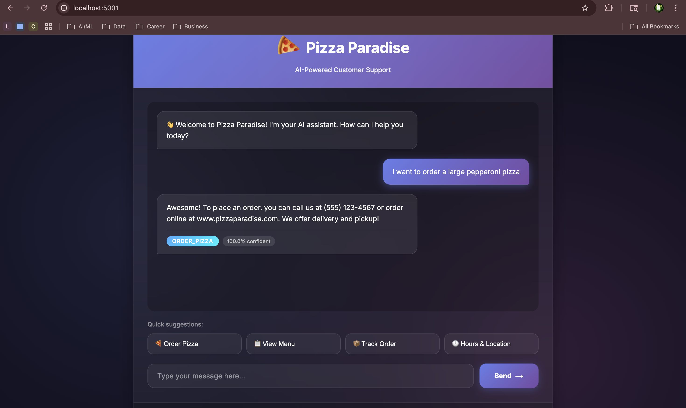

# Pizzaria-ot

A powerful, AI-driven Intent Classification system featuring a neural network backend and a modern Flask web interface. This project uses Natural Language Processing (NLP) to categorize user text inputs into predefined intents and responds accordingly.



## 🚀 Features

-   **Deep Learning Model**: Uses a Feedforward Neural Network (built with TensorFlow/Keras) for high-accuracy intent classification.
-   **Real-time Prediction**: Instant intent recognition and confidence scoring.
-   **Web Interface**: A clean, responsive chat interface served via Flask.
-   **REST API**: JSON-based API endpoints for easy integration with other systems.
-   **Customizable**: Easily trainable on new datasets via `training_data.json`.

## 📂 Project Structure

```
├── app.py                 # Main Flask application entry point
├── model.py               # Neural network architecture definition (Keras)
├── train.py               # Script to train the model and save artifacts
├── predict.py             # CLI script for testing predictions
├── training_data.json     # Dataset containing patterns and tags
├── requirements.txt       # Python dependencies
├── templates/
│   └── index.html         # Web chat interface
└── static/
    └── [css/js]           # Static assets
```

## 🛠️ Installation

1.  **Clone the repository** (if applicable).

2.  **Create a virtual environment** (recommended):
    ```bash
    python -m venv .venv
    source .venv/bin/activate  # On Windows: .venv\Scripts\activate
    ```

3.  **Install dependencies**:
    ```bash
    pip install -r requirements.txt
    ```

## 🧠 Training the Model

Before running the application for the first time, you must train the model to generate the necessary artifacts (`.h5`, `.pkl`, `.json`).

1.  Ensure `training_data.json` is populated with your intents and patterns.
2.  Run the training script:
    ```bash
    python train.py
    ```
    This will create:
    -   `intent_classifier_model.h5` (The Model)
    -   `vectorizer.pkl` (TF-IDF Vectorizer)
    -   `label_encoder.pkl` (Label Encoder)
    -   `responses.json` (Response maps)

## 🖥️ Usage

### Running the Web App
Start the Flask server:
```bash
python app.py
```
Open your browser and navigate to `http://localhost:5001`.

### API Usage
The application exposes a `/predict` endpoint:

**Endpoint**: `POST /predict`
**Content-Type**: `application/json`
**Body**:
```json
{
  "text": "Hello, how are you?"
}
```

**Response**:
```json
{
  "intent": "greeting",
  "confidence": 0.98,
  "response": "Hi there! How can I help you?",
  "all_probabilities": { ... }
}
```

## 🔍 Model Details
-   **Architecture**: Fully Connected Neural Network (Dense Layers)
-   **Input**: TF-IDF vectorized text (ngram_range=(1,2))
-   **Optimization**: Adam Optimizer, Sparse Categorical Crossentropy Loss

    
